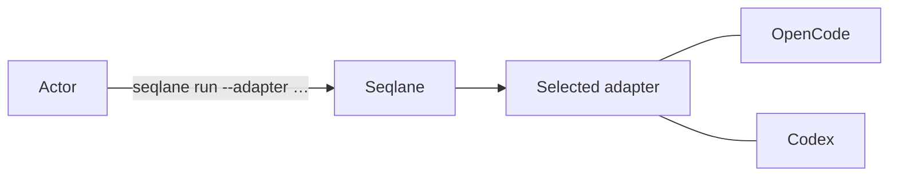

# Seqlane

Seqlane is a typed TypeScript workflow runtime for software-engineering work.
Define tasks with Zod schemas, connect them in a static graph, and run the
graph from the CLI.

Workflows can combine:

- agent tasks that use a configured runtime;
- deterministic tasks that run in the Seqlane process; and
- local process tasks that use direct executable arguments.

Seqlane checks task inputs and outputs at runtime. The workflow graph also
declares task dependencies, session use, and workspace coordination.

> Seqlane is in active development. Breaking changes can occur while its
> contracts and package boundaries evolve.

## How it works



## Workflow layer and runtime layer

Seqlane is the workflow layer. It defines typed tasks, task dependencies,
schemas, sessions, workspace policy, and workflow outputs.

Every run also selects a runtime profile. The runtime layer executes tasks and
owns models, tools, permissions, processes, and adapter configuration.

The built-in `local` profile runs deterministic tasks without an adapter. An
agent task needs a configured adapter runtime, such as OpenCode. The workflow
does not contain the adapter URL or its credentials.

Choose the runtime profile when you start a run:

```text
workflow layer:  workflow.ts + runtime profile: local
workflow layer:  workflow.ts + runtime profile: direct
```

This separation keeps the same workflow portable across runtime environments.

## Current Mastra dependency

Mastra is the runtime engine used by Seqlane today. Seqlane owns the workflow
authoring API, typed Plan, task contracts, session policies, workspace policies,
and stable CLI and event contracts. The private runtime layer compiles each
Seqlane Plan into Mastra workflows and steps, then uses Mastra to execute the
workflow.

Users write workflows against `@seqlane/core`; they do not need to use Mastra
workflow APIs directly. Mastra remains behind the Seqlane runtime boundary and
currently supplies workflow execution, operational API and MCP transport,
storage, tracing, and the Community Studio integration.

## Install Seqlane

Use Node.js 24 or later.

Install the CLI globally:

```sh
npm install --global seqlane
```

For a project-local installation, add the CLI and workflow dependencies:

```sh
npm install --save-dev seqlane
npm install @seqlane/core zod
```

Run a project-local CLI with `npx seqlane`. Run a global installation with
`seqlane`. `seqlane` and `@seqlane/core` are the supported public packages.
Other `@seqlane` packages can install as implementation dependencies.

## Write a workflow

Create `workflow.ts` in the repository root:

```ts
import { createFlow, defineAgentTask } from "@seqlane/core";
import { z } from "zod";

const input = z.object({ topic: z.string().min(1) });
const output = z.object({ answer: z.string() });

const answerTask = defineAgentTask({
  id: "answer-topic",
  input,
  output,
  goal: ({ topic }) => `Write a concise answer about ${topic}.`,
  instructions: ["Return only the answer."],
});

export default createFlow({
  id: "answer-topic",
  input,
  output,
})
  .task("answer", answerTask, ({ input }) => input)
  .output(({ tasks }) => tasks.answer.output)
  .define();
```

The workflow export must be the default export when you pass a file without an
export name. Use `workflow.ts#namedExport` for a named export. The CLI accepts
`.ts`, `.mts`, `.js`, and `.mjs` workflow files.

## Choose a task factory

Every task has an ID, an input schema, an output schema, and an execution
contract. Choose the factory that matches the work.

### `defineTask`

Use `defineTask` for deterministic TypeScript logic. The factory does not add a
model call. A custom `execute` function can use `context.exec` or explicitly
call `context.runAgent` when that is part of the task's design.

```ts
import { createFlow, defineTask } from "@seqlane/core";
import { z } from "zod";

const input = z.object({ value: z.string() });
const output = z.object({ value: z.string() });

const localTask = defineTask({
  id: "copy-value",
  input,
  output,
  execute: async ({ input }) => input,
});

export default createFlow({ id: "local", input, output })
  .task("copy", localTask, ({ input }) => input)
  .output(({ tasks }) => tasks.copy.output)
  .define();
```

### `defineAgentTask`

Use `defineAgentTask` when a configured runtime agent must produce the result.
The factory turns `goal`, `instructions`, and optional `references` into an
agent execution. The task's output schema validates the structured result.

```ts
import { defineAgentTask } from "@seqlane/core";
import { z } from "zod";

const summarizeTask = defineAgentTask({
  id: "summarize",
  input: z.object({ text: z.string() }),
  output: z.object({ summary: z.string() }),
  goal: ({ text }) => `Summarize this text: ${text}`,
  instructions: ["Return one concise summary."],
});
```

Agent tasks require a runtime adapter, such as the OpenCode configuration shown
in [Run an agent workflow](#run-an-agent-workflow).

### `defineShellTask`

Use `defineShellTask` when a task must run a local executable. Seqlane passes the
executable and argument list directly and does not invoke a shell. The output
is always `{ exitCode, stdout, stderr }`; do not provide a custom `output`
schema or `execute` function.

```ts
import { defineShellTask } from "@seqlane/core";
import { z } from "zod";

const gitStatusTask = defineShellTask({
  id: "git-status",
  input: z.object({}),
  executable: "git",
  argv: () => ["status", "--porcelain=v1"],
});
```

See the [workflow examples](workflows/README.md) and the
[`@seqlane/core` guide](libs/core/README.md) for sessions, branches,
validators, references, and workspace policies.

## Declare workspace, session, and task dependencies

These declarations describe how Seqlane can schedule work. They do not grant
filesystem or executor permissions. Configure those permissions in the runtime.

### Workspace convention

Use `workspace: "shared"` for read-only work. Shared tasks can run at the same
time, so multiple sessions can inspect the same workspace concurrently.

Use `workspace: "exclusive"` whenever a task can write to the workspace or has
the intention to write. An exclusive task waits for all workspace work to end,
and no other shared or exclusive task uses that workspace until it finishes.
Omit the option only when the default exclusive behavior is appropriate.

```ts
// These tasks can inspect the same workspace at the same time.
.task("read-status", readStatusTask, ({ input }) => input, {
  workspace: "shared",
})
.task("read-diff", readDiffTask, ({ input }) => input, {
  workspace: "shared",
})

// This task may write, so it gets exclusive workspace access.
.task("apply-change", applyChangeTask, ({ input }) => input, {
  workspace: "exclusive",
})
```

Seqlane does not inspect a task to decide whether it reads or writes. The
workflow author must declare the scheduling policy. The policy coordinates
tasks; it does not make a task read-only or prevent filesystem access.

### Session convention

Choose a session policy based on the history that a task needs:

- `isolated()` creates a new session with no previous task history.
- `reuse(previous.session)` continues the exact previous session. The previous
  task must finish before the next task can use that session.
- `branch(previous.session)` creates a new session from the previous session's
  checkpoint. The branch keeps the previous history but can then proceed
  independently. The selected runtime must support native checkpoint forks.

```ts
.task("draft", draftTask, ({ input }) => input, {
  session: isolated(),
})
.task("polish", polishTask, ({ tasks }) => tasks.draft.output, {
  session: ({ tasks }) => reuse(tasks.draft.session),
})
.task("alternative", alternativeTask, ({ tasks }) => tasks.draft.output, {
  session: ({ tasks }) => branch(tasks.draft.session),
})
```

Two tasks must never execute at the same time on the same session. Independent
isolated sessions and completed branches can run in parallel when their graph,
workspace, and runtime-capacity rules allow it.

### Input, output, and execution dependencies

An input binding that reads a task output creates a data dependency. Seqlane
waits for the producing task, validates its output, and passes that typed value
to the consuming task. A session reuse or branch also creates a dependency on
the source task's checkpoint.

Use `dependsOn` when a task needs another task to finish but does not need its
output. Do not rely on declaration order: the workflow becomes a static DAG,
and input references, session relationships, and explicit `dependsOn` entries
define its execution order.

```ts
.task("prepare", prepareTask, ({ input }) => input, {
  workspace: "shared",
})
.task("review", reviewTask, ({ tasks }) => tasks.prepare.output, {
  workspace: "shared",
})
.task("audit", auditTask, ({ input }) => input, {
  workspace: "shared",
})
.task("publish", publishTask, ({ tasks }) => tasks.review.output, {
  workspace: "exclusive",
  dependsOn: ["audit"],
})
```

Here, `review` receives `prepare`'s typed output, so it cannot start until
`prepare` has completed successfully. `publish` also waits for `audit` because
of `dependsOn`, even though it does not read `audit`'s output.

## Run a workflow

### Run a local-only workflow

The included local-only example does not need an agent runtime:

```sh
seqlane run ./workflows/local-only-example/workflow.ts \
  --input '{"value":"local"}'
```

### Run an agent workflow

`run` defaults to no adapter. Local-only workflows do not need configuration.
Agent tasks select a direct-run adapter. OpenCode uses a service owned by the
run in managed mode. Codex uses its native discovery defaults.

Run an agent workflow with OpenCode:

```sh
seqlane run ./workflow.ts \
  --input '{"topic":"Seqlane"}' \
  --adapter opencode
```

For Codex, provide the runtime workspace explicitly:

```sh
seqlane run ./workflow.ts \
  --input '{"topic":"Seqlane"}' \
  --adapter codex \
  --workspace "$PWD"
```

OpenCode accepts `--opencode-mode`, `--opencode-host`, and `--opencode-port`.
Managed mode is the default. It uses loopback host `127.0.0.1` and port `0` by
default. Port `0` selects an ephemeral port.

External mode requires `--opencode-mode external`, `--opencode-host`, and
`--opencode-port`. The host must be loopback. The port must be from `1`
through `65535`. Seqlane does not start or stop an external service.

One strict Zod discriminated schema validates adapter-specific values before
they enter the private worker bootstrap. They never enter workflow input or
runner IPC.

Use `--input-file <path>` for JSON input from a file. The CLI accepts one input
source per run, and input files have a 1 MiB limit.

## Use the CLI

The CLI runs one workflow and prints the result. Add `--adapter opencode` or
`--adapter codex` when the workflow contains agent tasks. Run
`seqlane run --help` to see all options. See the
[CLI guide](apps/cli/README.md) for input, output, adapter, and workspace
options.

## Route oversized reads to context analysis

This repository includes the `read-context` workflow. It retrieves a
small, source-grounded evidence set with native `rg`, and optionally uses
installed zvec-grep and Ripwire tools before asking
`openai/gpt-5.6-luna` with medium reasoning for a structured answer. Runtime
configuration remains authoritative for executor permissions.

Build and run it with the normal Seqlane CLI:

```sh
pnpm build
pnpm exec node apps/cli/bin/run.js run workflows/read-context/workflow.ts \
  --input '{"question":"Trace how model settings reach the session request","paths":["libs/runtime/src"]}' \
  --adapter opencode \
  --workspace "$PWD"
```

Select an adapter with `--adapter opencode` or `--adapter codex` when this
workflow needs an agent task. The workflow explicitly selects
`openai/gpt-5.6-luna` with medium reasoning. Optional `zg`/zvec-grep and
`ripwire` failures are reported as uncertainties.

Evidence is bounded to a 32,000-byte retrieval corpus. Scan and corpus limits
are reported as uncertainties when they exclude evidence.

The project-local Codex hook in `.codex/hooks.json` denies supported oversized
broad reads, unscoped or unsupported read-like commands, and denied paths. It
points the active session to `seqlane run workflows/read-context/workflow.ts` for the
`read-context` workflow. Trust the project-local hook through `/hooks`
before enabling it. The hook fails open for commands it cannot classify as
read-like. Read-context sends selected source to the configured endpoint, so
review the endpoint's privacy and retention policy.

## License

Seqlane is licensed under the [Apache License 2.0](LICENSE).
